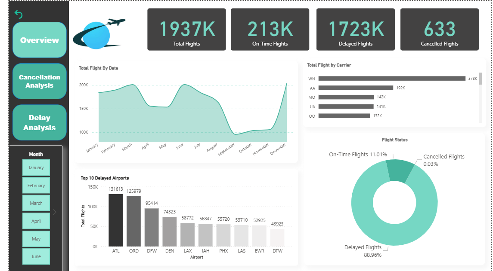

# ✈️ Flight Delay Analysis Dashboard

This Power BI project analyzes flight data to uncover trends in delays, cancellations, and performance across airlines, airports, and months. The visualizations aim to help stakeholders understand which factors contribute to flight delays and how different regions, times, and carriers perform.

---

## 🧩 Data Model

The model follows a **star schema**, with `FactFlights` at the center and several connected dimension tables:

**Key Tables:**
- `FactFlights`: Stores flight-level data including time, delays, and cancellations
- `DimCarrier`: Airline details
- `DimAirport`: Airport information
- `DimCancellationStatus`: Reasons for flight cancellation
- `DimDates` & `DimTimes`: Calendar and time breakdowns
- `AirCraftDim`: Aircraft details
- `DAX Measures`: Contains calculated KPIs like average delays

---

## 📊 Dashboard Views

### 🔹 Overview Dashboard

Provides a high-level view of total flights, average delays, and flight status distribution by month and carrier.

**Highlights:**
- Total Flights, On-Time, Delayed, and Cancelled counts
- Monthly trends for flight volume
- Top 10 busiest airports
- Carrier-wise total flight comparison
- Donut chart showing flight status percentages

---

### 🔹 Delay Analysis

Focuses on identifying patterns in delayed flights by carrier and airport.

**Highlights:**
- Monthly delayed vs on-time trends
- Top 10 airports with highest delay rates
- Comparison of average departure and arrival delay
- Delay counts by airline

---

## 📁 About the Project

- 📌 Tool Used: **Power BI**
- 📊 Dataset: Simulated flight data including delay times, cancellations, airlines, and more
- 🎯 Objective: Help stakeholders identify key reasons and patterns behind flight delays and cancellations

---

## ✅ Skills Applied
Star Schema Data Modeling
DAX Calculations & Measures
Power BI Dashboard Design
Visual storytelling with data
Bookmarks

---

## 💡 Key KPIs
- Total Flights
- On-Time Flights
- Delayed Flights
- Cancelled Flights
- Average Arrival Delay (min)
- Average Departure Delay (min)

